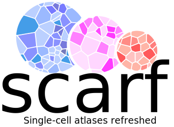

=====
Scarf
=====

|IMG1|

Scarf is a Python package to performs memory efficient analysis of single-cell genomics data.

- Analyze atlas scale datasets on your laptop (tested with upto 4 million cells)
- Perform analysis of scATAC-Seq data (datasets with upto 700K cells with 1 million peaks tested) under 10 GB RAM
- Make parallel implementations of UMAP and tSNE (SG-tSNE) for quick cell embedding
- Perform hierarchical clustering that gives interpretable cluster relationships
- Sub-sample hihgly representative cells using state-of-the-art TopACeDo method
- Perform quick and accurate projections of cells from one dataset onto another or integrate multiple datasets.

Install Scarf with::

    pip install scarf-toolkit

Read the documentation here: `scarf.rtfd.io`_ or jump to a `basic workflow of Scarf`_

.. _scarf.rtfd.io: http://scarf.rtfd.io
.. _basic workflow of Scarf: http://scarf.rtfd.io/en/latest/vignettes/public/basic_tutorial.html
