## Scarf workflow using 10K PBMC CITE-Seq data from 10x

This workflow is meant to familiarize users with Scarf API and how data is internally handled in Scarf. Please checkout the quick start guide if you are interested in the minimal steps required to run the analysis.


```python
%load_ext autotime

import scarf
```


```python
cd ../data/
```

    /media/parashar/d2-1-storage/storage/seq_data/scarf_manuscript/data
    time: 1.05 ms


Download data from 10x's website.


```python
# wget http://cf.10xgenomics.com/samples/cell-exp/3.0.0/pbmc_10k_protein_v3/pbmc_10k_protein_v3_filtered_feature_bc_matrix.h5
# mv pbmc_10k_protein_v3_filtered_feature_bc_matrix.h5 pbmc_10k_rna_prot.h5
```

    time: 57.9 ms


The first step of the analysis workflow is to convert the file into Zarr format that is support by Scarf. So we read in the data using CrH5Reader (stands for cellranger H5 reader). The reader object allows quick investigation of the file before the format is converted.

### 1) Format conversion


```python
reader = scarf.CrH5Reader(f'pbmc_10k_rna_prot.h5', 'rna')
```

    time: 116 ms


We can quickly check the number of cells and features (genes as well ADT features in this case) present in the file.


```python
reader.nCells, reader.nFeatures
```


    (7865, 33555)


    time: 6.08 ms


We can also quickly check the different kinds of assays present in the file and the number of features from each of them.


```python
reader.assayFeats
```


<div>

<table border="1" class="dataframe">
  <thead>
    <tr style="text-align: right;">
      <th></th>
      <th>RNA</th>
      <th>assay2</th>
    </tr>
  </thead>
  <tbody>
    <tr>
      <th>type</th>
      <td>Gene Expression</td>
      <td>Antibody Capture</td>
    </tr>
    <tr>
      <th>start</th>
      <td>0</td>
      <td>33538</td>
    </tr>
    <tr>
      <th>end</th>
      <td>33538</td>
      <td>33555</td>
    </tr>
    <tr>
      <th>nFeatures</th>
      <td>33538</td>
      <td>17</td>
    </tr>
  </tbody>
</table>
</div>


    time: 5.68 ms


nFeature column shows the number of features present in each assay. CrH5Reader will automatically pull this information from `features.tsv` and will rename the 'Gene Expression' assay to 'RNA'. Here it also found another assay: 'Antibody Capture' and named it to 'assay2'. We will rename this to 'ADT'.


```python
reader.rename_assays({'assay2': 'ADT'})
reader.assayFeats
```


<div>

<table border="1" class="dataframe">
  <thead>
    <tr style="text-align: right;">
      <th></th>
      <th>RNA</th>
      <th>ADT</th>
    </tr>
  </thead>
  <tbody>
    <tr>
      <th>type</th>
      <td>Gene Expression</td>
      <td>Antibody Capture</td>
    </tr>
    <tr>
      <th>start</th>
      <td>0</td>
      <td>33538</td>
    </tr>
    <tr>
      <th>end</th>
      <td>33538</td>
      <td>33555</td>
    </tr>
    <tr>
      <th>nFeatures</th>
      <td>33538</td>
      <td>17</td>
    </tr>
  </tbody>
</table>
</div>


    time: 48.5 ms


Convert data to Zarr format that will be later on used by Scarf. For this we use Scarf's CrToZarr class. This class will first quickly ascertain the data to be written and will create a zarr format file for data to be written into. CrToZarr takes two mandatory arguments. The first is the cellranger reader an other is the name of the output file. NOTE: When we say zarr file, we actually mean zarr directory  because, unlike HDF5, Zarr hierarchy is organized as a directory structure.


```python
writer = scarf.CrToZarr(reader, zarr_fn=f'pbmc_10k_rna_prot.zarr', chunk_size=(1000, 1000))
```

    time: 228 ms


```python
# We can inpsect the zarr heirarchy of the output file.
print (writer.z.tree(expand=True))
```

    /
     ├── ADT
     │   ├── counts (7865, 17) uint32
     │   └── featureData
     │       ├── I (17,) bool
     │       ├── ids (17,) <U6
     │       └── names (17,) <U23
     ├── RNA
     │   ├── counts (7865, 33538) uint32
     │   └── featureData
     │       ├── I (33538,) bool
     │       ├── ids (33538,) <U15
     │       └── names (33538,) <U16
     └── cellData
         ├── I (7865,) bool
         ├── ids (7865,) <U18
         └── names (7865,) <U18
    time: 3.53 ms


The three top levels here are: 'RNA', 'ADT' and 'cellData'. The top levels are hence composed of two assays and the cellData level which is explained below. And finally, we dump the data into a zarr object.


```python
writer.dump(batch_size=1000)
```

    100%|██████████| 8/8 [00:02<00:00,  3.10it/s]
    
    time: 2.59 s


​    


Create a Scarf DataStore object. This object will be the primary way to interact with the data and all its constituent assays. The first time a zarr file is loaded, we need to set the default assay. Here we set the 'RNA' assay as the default assay. When a zarr file is loaded, scarf checks if some per cell statistics have been calculated. If not then nFeatures (no. of features per cell) and nCounts (total sum of feature counts per cell) are calculated. Scarf will also attempt to calculate % mitochondrial and ribosomal content per cell.


```python
ds = scarf.DataStore('pbmc_10k_rna_prot.zarr', default_assay='RNA')
```

    INFO: (ADT) Computing nCells and dropOuts
    [########################################] | 100% Completed |  0.1s


    /home/parashar/miniconda3/lib/python3.7/site-packages/distributed/dashboard/core.py:74: UserWarning: 
    Port 8787 is already in use. 
    Perhaps you already have a cluster running?
    Hosting the diagnostics dashboard on a random port instead.
      warnings.warn("\n" + msg)


    INFO: (RNA) Computing nCells and dropOuts
    [########################################] | 100% Completed |  1.4s
    INFO: (ADT) Computing nCounts
    [########################################] | 100% Completed |  0.2s
    INFO: (ADT) Computing nFeatures
    [########################################] | 100% Completed |  0.1s
    INFO: (RNA) Computing nCounts
    [########################################] | 100% Completed |  1.3s
    INFO: (RNA) Computing nFeatures
    [########################################] | 100% Completed |  1.3s
    Computing percentage of RNA_percentMito
    [########################################] | 100% Completed |  0.1s
    Computing percentage of RNA_percentRibo
    [########################################] | 100% Completed |  1.6s
    time: 7.33 s


Scarf uses Zarr format so that data can be stored in rectangular chunks. The raw data is saved in the `counts` level within each assay level in the Zarr hierarchy. It can easily be accessed as a Dask array using `rawData` attribute of the assay. For a standard analysis one would not to interact with the raw data directly. Scarf internally optimizes the use of this Dask array to minimize the memory requirement of all operations.


```python
ds.RNA.rawData
```


<table>
<tr>
<td>
<table>
  <thead>
    <tr><td> </td><th> Array </th><th> Chunk </th></tr>
  </thead>
  <tbody>
    <tr><th> Bytes </th><td> 1.06 GB </td> <td> 4.00 MB </td></tr>
    <tr><th> Shape </th><td> (7865, 33538) </td> <td> (1000, 1000) </td></tr>
    <tr><th> Count </th><td> 273 Tasks </td><td> 272 Chunks </td></tr>
    <tr><th> Type </th><td> uint32 </td><td> numpy.ndarray </td></tr>
  </tbody>
</table>
</td>
<td>
<svg width="170" height="92" style="stroke:rgb(0,0,0);stroke-width:1" >

  <!-- Horizontal lines -->
  <line x1="0" y1="0" x2="120" y2="0" style="stroke-width:2" />
  <line x1="0" y1="5" x2="120" y2="5" />
  <line x1="0" y1="10" x2="120" y2="10" />
  <line x1="0" y1="16" x2="120" y2="16" />
  <line x1="0" y1="21" x2="120" y2="21" />
  <line x1="0" y1="27" x2="120" y2="27" />
  <line x1="0" y1="32" x2="120" y2="32" />
  <line x1="0" y1="37" x2="120" y2="37" />
  <line x1="0" y1="42" x2="120" y2="42" style="stroke-width:2" />

  <!-- Vertical lines -->
  <line x1="0" y1="0" x2="0" y2="42" style="stroke-width:2" />
  <line x1="3" y1="0" x2="3" y2="42" />
  <line x1="7" y1="0" x2="7" y2="42" />
  <line x1="10" y1="0" x2="10" y2="42" />
  <line x1="14" y1="0" x2="14" y2="42" />
  <line x1="17" y1="0" x2="17" y2="42" />
  <line x1="21" y1="0" x2="21" y2="42" />
  <line x1="25" y1="0" x2="25" y2="42" />
  <line x1="28" y1="0" x2="28" y2="42" />
  <line x1="32" y1="0" x2="32" y2="42" />
  <line x1="35" y1="0" x2="35" y2="42" />
  <line x1="39" y1="0" x2="39" y2="42" />
  <line x1="42" y1="0" x2="42" y2="42" />
  <line x1="46" y1="0" x2="46" y2="42" />
  <line x1="50" y1="0" x2="50" y2="42" />
  <line x1="53" y1="0" x2="53" y2="42" />
  <line x1="57" y1="0" x2="57" y2="42" />
  <line x1="60" y1="0" x2="60" y2="42" />
  <line x1="64" y1="0" x2="64" y2="42" />
  <line x1="67" y1="0" x2="67" y2="42" />
  <line x1="71" y1="0" x2="71" y2="42" />
  <line x1="75" y1="0" x2="75" y2="42" />
  <line x1="78" y1="0" x2="78" y2="42" />
  <line x1="82" y1="0" x2="82" y2="42" />
  <line x1="85" y1="0" x2="85" y2="42" />
  <line x1="89" y1="0" x2="89" y2="42" />
  <line x1="93" y1="0" x2="93" y2="42" />
  <line x1="96" y1="0" x2="96" y2="42" />
  <line x1="100" y1="0" x2="100" y2="42" />
  <line x1="103" y1="0" x2="103" y2="42" />
  <line x1="107" y1="0" x2="107" y2="42" />
  <line x1="110" y1="0" x2="110" y2="42" />
  <line x1="114" y1="0" x2="114" y2="42" />
  <line x1="118" y1="0" x2="118" y2="42" />
  <line x1="120" y1="0" x2="120" y2="42" style="stroke-width:2" />

  <!-- Colored Rectangle -->
  <polygon points="0.000000,0.000000 120.000000,0.000000 120.000000,42.655092 0.000000,42.655092" style="fill:#ECB172A0;stroke-width:0"/>

  <!-- Text -->
  <text x="60.000000" y="62.655092" font-size="1.0rem" font-weight="100" text-anchor="middle" >33538</text>
  <text x="140.000000" y="21.327546" font-size="1.0rem" font-weight="100" text-anchor="middle" transform="rotate(-90,140.000000,21.327546)">7865</text>
</svg>
</td>
</tr>
</table>


    time: 3.79 ms


### 2) Cell filtering

We can visualize these per cell statistics in violin plots.


```python
ds.plot_cells_dists(cols=['percent*'], all_cells=True)
```


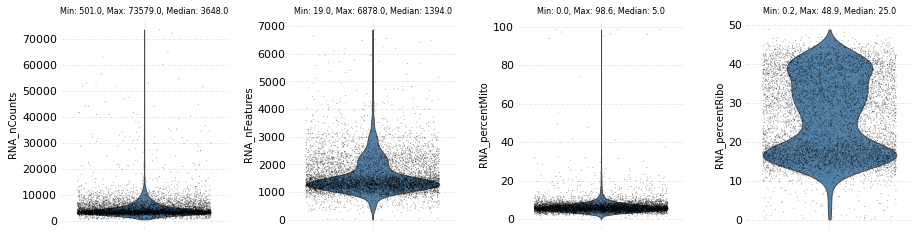


    time: 1.36 s


We can filter cells based on these cell attributes by providing upper and lower threshold values.


```python
ds.filter_cells(attrs=['RNA_nCounts', 'RNA_nFeatures', 'RNA_percentMito'], highs=[20000, 5000, 25], lows=[1000, 500, 0])
```

    INFO: 203 cells failed filtering for RNA_nCounts
    INFO: 113 cells failed filtering for RNA_nFeatures
    INFO: 35 cells failed filtering for RNA_percentMito
    time: 12.8 ms


Now we visualize the attributes again after filtering the values.


```python
ds.plot_cells_dists(cols=['percent*'])
```


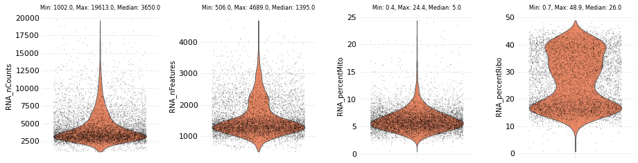


    time: 568 ms


Scarf attempts to store most of the data into the disk immediately after it is calculated. Below we can see that the calculated cell attributes can now be found under the cellData level.


```python
print (ds.z.tree(expand=True))
```

    /
     ├── ADT
     │   ├── counts (7865, 17) uint32
     │   └── featureData
     │       ├── I (17,) bool
     │       ├── dropOuts (17,) int64
     │       ├── ids (17,) <U6
     │       ├── nCells (17,) int64
     │       └── names (17,) <U23
     ├── RNA
     │   ├── counts (7865, 33538) uint32
     │   └── featureData
     │       ├── I (33538,) bool
     │       ├── dropOuts (33538,) int64
     │       ├── ids (33538,) <U15
     │       ├── nCells (33538,) int64
     │       └── names (33538,) <U16
     └── cellData
         ├── ADT_nCounts (7865,) uint64
         ├── ADT_nFeatures (7865,) int64
         ├── I (7865,) bool
         ├── RNA_nCounts (7865,) uint64
         ├── RNA_nFeatures (7865,) int64
         ├── RNA_percentMito (7865,) float64
         ├── RNA_percentRibo (7865,) float64
         ├── ids (7865,) <U18
         └── names (7865,) <U18
    time: 7.78 ms


The data stored under the cellData level can easily be accessed using the `cells.table` attribute of the DataStore object.


```python
ds.cells.table
```


<div>

<table border="1" class="dataframe">
  <thead>
    <tr style="text-align: right;">
      <th></th>
      <th>I</th>
      <th>ids</th>
      <th>names</th>
      <th>ADT_nCounts</th>
      <th>ADT_nFeatures</th>
      <th>RNA_nCounts</th>
      <th>RNA_nFeatures</th>
      <th>RNA_percentMito</th>
      <th>RNA_percentRibo</th>
    </tr>
  </thead>
  <tbody>
    <tr>
      <th>0</th>
      <td>True</td>
      <td>AAACCCAAGATTGTGA-1</td>
      <td>AAACCCAAGATTGTGA-1</td>
      <td>981</td>
      <td>17</td>
      <td>6160</td>
      <td>2194</td>
      <td>8.490260</td>
      <td>15.259740</td>
    </tr>
    <tr>
      <th>1</th>
      <td>True</td>
      <td>AAACCCACATCGGTTA-1</td>
      <td>AAACCCACATCGGTTA-1</td>
      <td>1475</td>
      <td>17</td>
      <td>6713</td>
      <td>2093</td>
      <td>6.182035</td>
      <td>19.037688</td>
    </tr>
    <tr>
      <th>2</th>
      <td>True</td>
      <td>AAACCCAGTACCGCGT-1</td>
      <td>AAACCCAGTACCGCGT-1</td>
      <td>7149</td>
      <td>17</td>
      <td>3637</td>
      <td>1518</td>
      <td>7.891119</td>
      <td>16.002200</td>
    </tr>
    <tr>
      <th>3</th>
      <td>True</td>
      <td>AAACCCAGTATCGAAA-1</td>
      <td>AAACCCAGTATCGAAA-1</td>
      <td>6831</td>
      <td>17</td>
      <td>1244</td>
      <td>737</td>
      <td>8.842444</td>
      <td>18.729904</td>
    </tr>
    <tr>
      <th>4</th>
      <td>True</td>
      <td>AAACCCAGTCGTCATA-1</td>
      <td>AAACCCAGTCGTCATA-1</td>
      <td>6839</td>
      <td>17</td>
      <td>2611</td>
      <td>1240</td>
      <td>5.974722</td>
      <td>16.353887</td>
    </tr>
    <tr>
      <th>...</th>
      <td>...</td>
      <td>...</td>
      <td>...</td>
      <td>...</td>
      <td>...</td>
      <td>...</td>
      <td>...</td>
      <td>...</td>
      <td>...</td>
    </tr>
    <tr>
      <th>7860</th>
      <td>True</td>
      <td>TTTGTTGGTTCAAGTC-1</td>
      <td>TTTGTTGGTTCAAGTC-1</td>
      <td>9520</td>
      <td>17</td>
      <td>5830</td>
      <td>2178</td>
      <td>5.540309</td>
      <td>24.579760</td>
    </tr>
    <tr>
      <th>7861</th>
      <td>True</td>
      <td>TTTGTTGGTTGCATGT-1</td>
      <td>TTTGTTGGTTGCATGT-1</td>
      <td>7763</td>
      <td>17</td>
      <td>4096</td>
      <td>1256</td>
      <td>6.250000</td>
      <td>45.166016</td>
    </tr>
    <tr>
      <th>7862</th>
      <td>True</td>
      <td>TTTGTTGGTTGCGGCT-1</td>
      <td>TTTGTTGGTTGCGGCT-1</td>
      <td>1973</td>
      <td>17</td>
      <td>5524</td>
      <td>1907</td>
      <td>10.391021</td>
      <td>15.550326</td>
    </tr>
    <tr>
      <th>7863</th>
      <td>True</td>
      <td>TTTGTTGTCGAGTGAG-1</td>
      <td>TTTGTTGTCGAGTGAG-1</td>
      <td>4316</td>
      <td>17</td>
      <td>4039</td>
      <td>1605</td>
      <td>6.709582</td>
      <td>28.026739</td>
    </tr>
    <tr>
      <th>7864</th>
      <td>True</td>
      <td>TTTGTTGTCGTTCAGA-1</td>
      <td>TTTGTTGTCGTTCAGA-1</td>
      <td>5682</td>
      <td>16</td>
      <td>4213</td>
      <td>1549</td>
      <td>4.960836</td>
      <td>33.918823</td>
    </tr>
  </tbody>
</table>
<p>7865 rows × 9 columns</p>
</div>


    time: 22.2 ms


### 3) Feature selection

The 'I' column is set to False for cells that were filtered out. NOTE: We strongly discourage directly adding or removing the data from this table as Scarf will not be able to synchronize the changes to the disk. Instead use methods of the cell attribute. Please refer to `add`, `fetch`, `remove` and `update` methods.

Similar to the cell table and cellData zarr level. Scarf also saves the feature level data under featureData that is located within each assay. For example, for RNA assay the feature can be accessed as below:


```python
ds.RNA.feats.table
```


<div>

<table border="1" class="dataframe">
  <thead>
    <tr style="text-align: right;">
      <th></th>
      <th>I</th>
      <th>ids</th>
      <th>names</th>
      <th>nCells</th>
      <th>dropOuts</th>
    </tr>
  </thead>
  <tbody>
    <tr>
      <th>0</th>
      <td>False</td>
      <td>ENSG00000243485</td>
      <td>MIR1302-2HG</td>
      <td>0</td>
      <td>7865</td>
    </tr>
    <tr>
      <th>1</th>
      <td>False</td>
      <td>ENSG00000237613</td>
      <td>FAM138A</td>
      <td>0</td>
      <td>7865</td>
    </tr>
    <tr>
      <th>2</th>
      <td>False</td>
      <td>ENSG00000186092</td>
      <td>OR4F5</td>
      <td>0</td>
      <td>7865</td>
    </tr>
    <tr>
      <th>3</th>
      <td>False</td>
      <td>ENSG00000238009</td>
      <td>AL627309.1</td>
      <td>12</td>
      <td>7853</td>
    </tr>
    <tr>
      <th>4</th>
      <td>False</td>
      <td>ENSG00000239945</td>
      <td>AL627309.3</td>
      <td>0</td>
      <td>7865</td>
    </tr>
    <tr>
      <th>...</th>
      <td>...</td>
      <td>...</td>
      <td>...</td>
      <td>...</td>
      <td>...</td>
    </tr>
    <tr>
      <th>33533</th>
      <td>False</td>
      <td>ENSG00000277856</td>
      <td>AC233755.2</td>
      <td>0</td>
      <td>7865</td>
    </tr>
    <tr>
      <th>33534</th>
      <td>False</td>
      <td>ENSG00000275063</td>
      <td>AC233755.1</td>
      <td>5</td>
      <td>7860</td>
    </tr>
    <tr>
      <th>33535</th>
      <td>True</td>
      <td>ENSG00000271254</td>
      <td>AC240274.1</td>
      <td>42</td>
      <td>7823</td>
    </tr>
    <tr>
      <th>33536</th>
      <td>False</td>
      <td>ENSG00000277475</td>
      <td>AC213203.1</td>
      <td>0</td>
      <td>7865</td>
    </tr>
    <tr>
      <th>33537</th>
      <td>False</td>
      <td>ENSG00000268674</td>
      <td>FAM231C</td>
      <td>0</td>
      <td>7865</td>
    </tr>
  </tbody>
</table>
<p>33538 rows × 5 columns</p>
</div>


    time: 72.3 ms


Now the next step is to identify the highly variable genes in the dataset (RNA assay). This can be done using `mark_hvgs` method of the assay. The parameters govern the min/max variance (corrected) and mean expression threshold for calling genes highly variable. 

The variance is corrected by first dividing genes into bins based on their mean expression values. Gene with minimum variance is selected from each bin and a Lowess curve to the mean-variance trend of these genes. `mark_hvgs` will by default run on the default assay

A plot is produced showing, for each gene, the corrected variance on the y-axis and the non-zero mean (mean from cells where the gene had a non-zero value) on the x-axis. The genes are colored in two gradients which indicate the number of cells were the gene expressed. Yellow to dark red for HVGs and blue to green for non-HVGs.

The `mark_hvgs` function has a parameter `cell_key` that dictates which cells to use to identify the HVGs. The default value of this parameter is `I` which means it will use the filtered cells.


```python
ds.RNA.mark_hvgs(min_cells=20, top_n=2000, n_bins=50)
```

    INFO: (RNA) Computing nCells
    [########################################] | 100% Completed |  2.3s
    INFO: (RNA) Computing normed_tot
    [########################################] | 100% Completed |  2.1s
    INFO: (RNA) Computing sigmas
    [########################################] | 100% Completed |  2.5s
    INFO: 2000 genes marked as HVGs


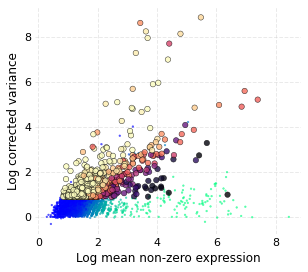


    time: 8.38 s


As a result of running `mark_hvgs`, the feature table now has an extra column `I__hvgs` which contains a True value for genes marked HVGs. The naming rule in Scarf dictates that cells used to identify HVGs are prepended to column name (with double underscore delimiter). Since we did not provide any `cell_key` parameter the default value was used i.e. the filtered cells so 'I' was prepended.


```python
ds.RNA.feats.table
```


<div>

<table border="1" class="dataframe">
  <thead>
    <tr style="text-align: right;">
      <th></th>
      <th>I</th>
      <th>ids</th>
      <th>names</th>
      <th>nCells</th>
      <th>dropOuts</th>
      <th>I__hvgs</th>
    </tr>
  </thead>
  <tbody>
    <tr>
      <th>0</th>
      <td>False</td>
      <td>ENSG00000243485</td>
      <td>MIR1302-2HG</td>
      <td>0</td>
      <td>7865</td>
      <td>False</td>
    </tr>
    <tr>
      <th>1</th>
      <td>False</td>
      <td>ENSG00000237613</td>
      <td>FAM138A</td>
      <td>0</td>
      <td>7865</td>
      <td>False</td>
    </tr>
    <tr>
      <th>2</th>
      <td>False</td>
      <td>ENSG00000186092</td>
      <td>OR4F5</td>
      <td>0</td>
      <td>7865</td>
      <td>False</td>
    </tr>
    <tr>
      <th>3</th>
      <td>False</td>
      <td>ENSG00000238009</td>
      <td>AL627309.1</td>
      <td>12</td>
      <td>7853</td>
      <td>False</td>
    </tr>
    <tr>
      <th>4</th>
      <td>False</td>
      <td>ENSG00000239945</td>
      <td>AL627309.3</td>
      <td>0</td>
      <td>7865</td>
      <td>False</td>
    </tr>
    <tr>
      <th>...</th>
      <td>...</td>
      <td>...</td>
      <td>...</td>
      <td>...</td>
      <td>...</td>
      <td>...</td>
    </tr>
    <tr>
      <th>33533</th>
      <td>False</td>
      <td>ENSG00000277856</td>
      <td>AC233755.2</td>
      <td>0</td>
      <td>7865</td>
      <td>False</td>
    </tr>
    <tr>
      <th>33534</th>
      <td>False</td>
      <td>ENSG00000275063</td>
      <td>AC233755.1</td>
      <td>5</td>
      <td>7860</td>
      <td>False</td>
    </tr>
    <tr>
      <th>33535</th>
      <td>True</td>
      <td>ENSG00000271254</td>
      <td>AC240274.1</td>
      <td>42</td>
      <td>7823</td>
      <td>True</td>
    </tr>
    <tr>
      <th>33536</th>
      <td>False</td>
      <td>ENSG00000277475</td>
      <td>AC213203.1</td>
      <td>0</td>
      <td>7865</td>
      <td>False</td>
    </tr>
    <tr>
      <th>33537</th>
      <td>False</td>
      <td>ENSG00000268674</td>
      <td>FAM231C</td>
      <td>0</td>
      <td>7865</td>
      <td>False</td>
    </tr>
  </tbody>
</table>
<p>33538 rows × 6 columns</p>
</div>


    time: 12.2 ms


### 4) Graph creation

Creating a neighbourhood graph of cells is the most critical step in any Scarf workflow. This step internally involves multiple substeps: 
- data normalization for selected features
- linear dimension reduction using PCA
- creating an approximate nearest neighbour graph index (using HNSWlib library)
- querying cells against this index to identify nearest neighbours for each cell
- Edge weight computation using compute_membership_strengths function from UMAP package
- Fitting MiniBatch Kmeans (The kmeans centers are used later for UMAP initialization)


```python
ds.make_graph(feat_key='hvgs', k=21, dims=31, n_centroids=100)
```

    INFO: No value provided for parameter `log_transform`. Will use default value: True
    INFO: No value provided for parameter `renormalize_subset`. Will use default value: True
    INFO: No value provided for parameter `pca_cell_key`. Will use same value as cell_key: I
    INFO: Using PCA for dimension reduction
    INFO: No value provided for parameter `ann_metric`. Will use default value: l2
    INFO: No value provided for parameter `ann_efc`. Will use default value: min(max(48, int(dims * 1.5)), 64)
    INFO: No value provided for parameter `ann_efc`. Will use default value: min(max(48, int(dims * 1.5)), 64)
    INFO: No value provided for parameter `ann_m`. Will use default value: 48
    INFO: No value provided for parameter `rand_state`. Will use default value: 4466
    INFO: No value provided for parameter `local_connectivity`. Will use default value: 1.0
    INFO: No value provided for parameter `bandwidth`. Will use default value: 1.5
    INFO: Normalizing with feature subset
    [########################################] | 100% Completed |  1.7s


    Writing data to normed__I__hvgs/data: 100%|██████████| 8/8 [00:03<00:00,  2.24it/s]
    
    INFO: Calculating mean of norm. data
    [########################                ] | 61% Completed |  0.1s


​    


    [########################################] | 100% Completed |  0.2s
    INFO: Calculating std. dev. of norm. data
    [########################################] | 100% Completed |  0.2s


    Fitting PCA: 100%|██████████| 8/8 [00:05<00:00,  1.53it/s]
    Fitting ANN: 100%|██████████| 8/8 [00:00<00:00, 12.44it/s]
    Fitting kmeans: 100%|██████████| 8/8 [00:00<00:00, 17.42it/s]
    Estimating seed partitions: 100%|██████████| 8/8 [00:00<00:00, 21.85it/s]
    Saving KNN graph: 100%|██████████| 8/8 [00:00<00:00, 12.01it/s]
    
    INFO: ANN recall: 99.76%


​    
​    Smoothening KNN distances: 100%|██████████| 2/2 [00:02<00:00,  1.05s/it]
​    
​    time: 20 s


​    


All the results of `make_graph` are saved under 'normed\__{cell key}__{feature key}'. in this case since we did not provide a cell key, it takes default value of `I` which means all the filtered cells and feature key (`feat_key`) was set to `hvgs`. The directory is organized such that all the intermediate data is also saved. The intermediate data is organized in a hierarchy which triggers recomputation when upstream changes are detected. The parameter values are also saved in hierarchy level names. For example, 'reduction_pca_31_I' means that PCA linear dimension reduction with 31 PC axes was used and the PCA was fit across all the cells that have True value in column 'I'. 


```python
print (ds.RNA.z.tree(expand=True))
```

    RNA
     ├── counts (7865, 33538) uint32
     ├── featureData
     │   ├── I (33538,) bool
     │   ├── I__hvgs (33538,) bool
     │   ├── dropOuts (33538,) int64
     │   ├── ids (33538,) <U15
     │   ├── nCells (33538,) int64
     │   └── names (33538,) <U16
     ├── normed__I__hvgs
     │   ├── data (7648, 2000) float64
     │   └── reduction__pca__31__I
     │       ├── ann__l2__63__63__48__4466
     │       │   └── knn__21
     │       │       ├── distances (7648, 21) float64
     │       │       ├── graph__1.0__1.5
     │       │       │   ├── edges (160608, 2) uint64
     │       │       │   └── weights (160608,) float64
     │       │       └── indices (7648, 21) uint64
     │       ├── kmeans__100__4466
     │       │   ├── cluster_centers (100, 31) float64
     │       │   └── cluster_labels (7648,) float64
     │       ├── mu (2000,) float64
     │       ├── reduction (2000, 31) float64
     │       └── sigma (2000,) float64
     └── summary_stats_I
         ├── avg (13791,) float64
         ├── c_var__50__0.1 (13791,) float64
         ├── normed_n (13791,) float64
         ├── normed_tot (13791,) float64
         ├── nz_mean (13791,) float64
         └── sigmas (13791,) float64
    time: 15.2 ms


The graph calculated by `make_graph` can be easily loaded using `load_graph` method like below. The graph is loaded as a sparse matrix of cells that were used for creating a graph. Following we show how the graph can be accessed if required, but normally Scarf handles the graph loading internally where required. 

Because Scarf saves all the intermediate data, it might be the case that a lot of graphs are stored in Zarr hierachy. `load_graph` will load only the latest graph that was computed (for the given assay, cell key and feat key). 


```python
ds.load_graph(from_assay='RNA', cell_key='I', feat_key='hvgs', graph_format='csr')
```


    <7648x7648 sparse matrix of type '<class 'numpy.float64'>'
    	with 160608 stored elements in Compressed Sparse Row format>


    time: 26.2 ms

The location of the latest graph can be accessed by `_get_latest_graph_loc` method. The latest graph location is set using the parameters used in the latest call to `make_graph`. If one needs to set the latest graph to one that was previously calculated then one needs to call `make_graph` with the corresponding parameters.

```python
ds._get_latest_graph_loc(from_assay='RNA', cell_key='I', feat_key='hvgs')
```


    'RNA/normed__I__hvgs/reduction__pca__31__I/ann__l2__63__63__48__4466/knn__21/graph__1.0__1.5'


    time: 28.5 ms


### 5) Low dimensional embedding and clustering

Next we run UMAP on the graph calculated above. Here we will not provide which assay, cell key or feature key to be used because we want the UMAP to run on the default assay with all the filtered cells and with the feature key used to calculate the latest graph. We can also provide the parameters values for the UMAP algorithm here


```python
ds.run_umap(fit_n_epochs=500, min_dist=0.5)
```

    	completed  0  /  500 epochs
    	completed  50  /  500 epochs
    	completed  100  /  500 epochs
    	completed  150  /  500 epochs
    	completed  200  /  500 epochs
    	completed  250  /  500 epochs
    	completed  300  /  500 epochs
    	completed  350  /  500 epochs
    	completed  400  /  500 epochs
    	completed  450  /  500 epochs


    distributed.comm.inproc - WARNING - Closing dangling queue in <InProc  local=inproc://130.235.165.21/11797/24 remote=inproc://130.235.165.21/11797/1>


    	completed  0  /  100 epochs
    	completed  10  /  100 epochs
    	completed  20  /  100 epochs
    	completed  30  /  100 epochs
    	completed  40  /  100 epochs
    	completed  50  /  100 epochs
    	completed  60  /  100 epochs
    	completed  70  /  100 epochs
    	completed  80  /  100 epochs
    	completed  90  /  100 epochs
    time: 34 s


The UMAP results are saved in the cell metadata table as seen below in columns: 'RNA_UMAP1' and 'RNA_UMAP2'


```python
ds.cells.table
```


<div>

<table border="1" class="dataframe">
  <thead>
    <tr style="text-align: right;">
      <th></th>
      <th>I</th>
      <th>ids</th>
      <th>names</th>
      <th>ADT_nCounts</th>
      <th>ADT_nFeatures</th>
      <th>RNA_nCounts</th>
      <th>RNA_nFeatures</th>
      <th>RNA_percentMito</th>
      <th>RNA_percentRibo</th>
      <th>RNA_UMAP1</th>
      <th>RNA_UMAP2</th>
    </tr>
  </thead>
  <tbody>
    <tr>
      <th>0</th>
      <td>True</td>
      <td>AAACCCAAGATTGTGA-1</td>
      <td>AAACCCAAGATTGTGA-1</td>
      <td>981</td>
      <td>17</td>
      <td>6160</td>
      <td>2194</td>
      <td>8.490260</td>
      <td>15.259740</td>
      <td>-4.195267</td>
      <td>16.038250</td>
    </tr>
    <tr>
      <th>1</th>
      <td>True</td>
      <td>AAACCCACATCGGTTA-1</td>
      <td>AAACCCACATCGGTTA-1</td>
      <td>1475</td>
      <td>17</td>
      <td>6713</td>
      <td>2093</td>
      <td>6.182035</td>
      <td>19.037688</td>
      <td>-2.622774</td>
      <td>14.973695</td>
    </tr>
    <tr>
      <th>2</th>
      <td>True</td>
      <td>AAACCCAGTACCGCGT-1</td>
      <td>AAACCCAGTACCGCGT-1</td>
      <td>7149</td>
      <td>17</td>
      <td>3637</td>
      <td>1518</td>
      <td>7.891119</td>
      <td>16.002200</td>
      <td>-3.689487</td>
      <td>18.120831</td>
    </tr>
    <tr>
      <th>3</th>
      <td>True</td>
      <td>AAACCCAGTATCGAAA-1</td>
      <td>AAACCCAGTATCGAAA-1</td>
      <td>6831</td>
      <td>17</td>
      <td>1244</td>
      <td>737</td>
      <td>8.842444</td>
      <td>18.729904</td>
      <td>-16.233088</td>
      <td>-1.070787</td>
    </tr>
    <tr>
      <th>4</th>
      <td>True</td>
      <td>AAACCCAGTCGTCATA-1</td>
      <td>AAACCCAGTCGTCATA-1</td>
      <td>6839</td>
      <td>17</td>
      <td>2611</td>
      <td>1240</td>
      <td>5.974722</td>
      <td>16.353887</td>
      <td>-19.788330</td>
      <td>-2.319168</td>
    </tr>
    <tr>
      <th>...</th>
      <td>...</td>
      <td>...</td>
      <td>...</td>
      <td>...</td>
      <td>...</td>
      <td>...</td>
      <td>...</td>
      <td>...</td>
      <td>...</td>
      <td>...</td>
      <td>...</td>
    </tr>
    <tr>
      <th>7860</th>
      <td>True</td>
      <td>TTTGTTGGTTCAAGTC-1</td>
      <td>TTTGTTGGTTCAAGTC-1</td>
      <td>9520</td>
      <td>17</td>
      <td>5830</td>
      <td>2178</td>
      <td>5.540309</td>
      <td>24.579760</td>
      <td>19.519470</td>
      <td>5.715518</td>
    </tr>
    <tr>
      <th>7861</th>
      <td>True</td>
      <td>TTTGTTGGTTGCATGT-1</td>
      <td>TTTGTTGGTTGCATGT-1</td>
      <td>7763</td>
      <td>17</td>
      <td>4096</td>
      <td>1256</td>
      <td>6.250000</td>
      <td>45.166016</td>
      <td>3.003565</td>
      <td>-11.135919</td>
    </tr>
    <tr>
      <th>7862</th>
      <td>True</td>
      <td>TTTGTTGGTTGCGGCT-1</td>
      <td>TTTGTTGGTTGCGGCT-1</td>
      <td>1973</td>
      <td>17</td>
      <td>5524</td>
      <td>1907</td>
      <td>10.391021</td>
      <td>15.550326</td>
      <td>-5.832784</td>
      <td>16.182123</td>
    </tr>
    <tr>
      <th>7863</th>
      <td>True</td>
      <td>TTTGTTGTCGAGTGAG-1</td>
      <td>TTTGTTGTCGAGTGAG-1</td>
      <td>4316</td>
      <td>17</td>
      <td>4039</td>
      <td>1605</td>
      <td>6.709582</td>
      <td>28.026739</td>
      <td>-8.718347</td>
      <td>-11.461886</td>
    </tr>
    <tr>
      <th>7864</th>
      <td>True</td>
      <td>TTTGTTGTCGTTCAGA-1</td>
      <td>TTTGTTGTCGTTCAGA-1</td>
      <td>5682</td>
      <td>16</td>
      <td>4213</td>
      <td>1549</td>
      <td>4.960836</td>
      <td>33.918823</td>
      <td>-1.431424</td>
      <td>-5.556267</td>
    </tr>
  </tbody>
</table>
<p>7865 rows × 11 columns</p>
</div>


    time: 18.9 ms


`plot_layout` is a versatile method to create a scatter plot using Scarf. Here we can plot the UMAP coordinates of all the filtered cells.


```python
ds.plot_layout(layout_key='RNA_UMAP')
```


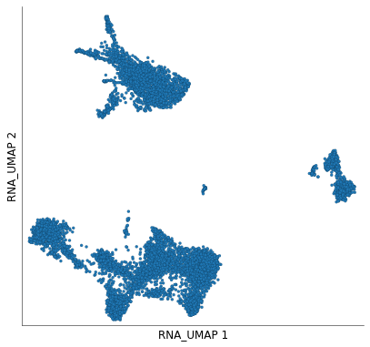


    time: 164 ms


`plot_layout` can be used to easily visualize data from any column of the cell metadata table. Following we visualize the number of genes expressed in each cell


```python
ds.plot_layout(layout_key='RNA_UMAP', color_by='RNA_nCounts', colormap='coolwarm')
```


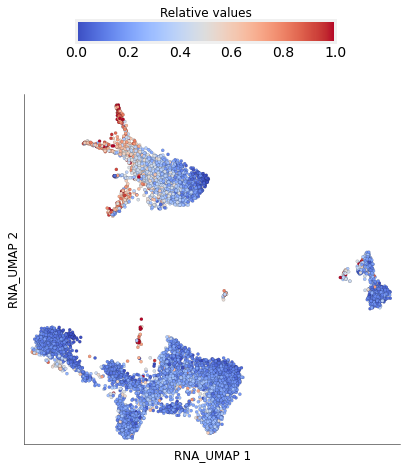


    time: 779 ms


Identifying clusters of cells is one of the central tenets of single cell approaches. Scarf includes two graph clustering methods and any (or even both) can be used on the dataset. The methods start with the same graph as the UMAP algorithm above to minimize the disparity between the UMAP and clustering results. The two clustering methods are:
- **Paris**: This is the default clustering algorithm that scales very well to millions of cells (yielding results in less than 10 mins for a million cells)
- **Leiden**: Leiden is a widely used graph clustering algorithm in single-cell genomics and provides very good results but is slower to run larger datasets.

We will first start with Paris, the default algorithm. Paris is hierarchical graph clustering algorithm that is based on node pair sampling. Paris creates a dendrogram of cells which can then be cut to obtain desired number of clusters. The advantage of using Paris, especially in the larger datasets, is that once the dendrogram has been created one can change the desired number of clusters with minimal computation overhead. 


```python
ds.run_clustering(n_clusters=25)
```

    time: 1.1 s


    /home/parashar/miniconda3/lib/python3.7/site-packages/sknetwork/hierarchy/postprocess.py:38: VisibleDeprecationWarning: Creating an ndarray from ragged nested sequences (which is a list-or-tuple of lists-or-tuples-or ndarrays with different lengths or shapes) is deprecated. If you meant to do this, you must specify 'dtype=object' when creating the ndarray
      clusters = np.array(list(cluster.values()))


The results of clustering algorithm are saved in the cell metadata table. In this case, they have been saved under 'RNA_cluster' column.


```python
ds.cells.table
```


<div>

<table border="1" class="dataframe">
  <thead>
    <tr style="text-align: right;">
      <th></th>
      <th>I</th>
      <th>ids</th>
      <th>names</th>
      <th>ADT_nCounts</th>
      <th>ADT_nFeatures</th>
      <th>RNA_nCounts</th>
      <th>RNA_nFeatures</th>
      <th>RNA_percentMito</th>
      <th>RNA_percentRibo</th>
      <th>RNA_UMAP1</th>
      <th>RNA_UMAP2</th>
      <th>RNA_cluster</th>
    </tr>
  </thead>
  <tbody>
    <tr>
      <th>0</th>
      <td>True</td>
      <td>AAACCCAAGATTGTGA-1</td>
      <td>AAACCCAAGATTGTGA-1</td>
      <td>981</td>
      <td>17</td>
      <td>6160</td>
      <td>2194</td>
      <td>8.490260</td>
      <td>15.259740</td>
      <td>-4.195267</td>
      <td>16.038250</td>
      <td>18</td>
    </tr>
    <tr>
      <th>1</th>
      <td>True</td>
      <td>AAACCCACATCGGTTA-1</td>
      <td>AAACCCACATCGGTTA-1</td>
      <td>1475</td>
      <td>17</td>
      <td>6713</td>
      <td>2093</td>
      <td>6.182035</td>
      <td>19.037688</td>
      <td>-2.622774</td>
      <td>14.973695</td>
      <td>2</td>
    </tr>
    <tr>
      <th>2</th>
      <td>True</td>
      <td>AAACCCAGTACCGCGT-1</td>
      <td>AAACCCAGTACCGCGT-1</td>
      <td>7149</td>
      <td>17</td>
      <td>3637</td>
      <td>1518</td>
      <td>7.891119</td>
      <td>16.002200</td>
      <td>-3.689487</td>
      <td>18.120831</td>
      <td>2</td>
    </tr>
    <tr>
      <th>3</th>
      <td>True</td>
      <td>AAACCCAGTATCGAAA-1</td>
      <td>AAACCCAGTATCGAAA-1</td>
      <td>6831</td>
      <td>17</td>
      <td>1244</td>
      <td>737</td>
      <td>8.842444</td>
      <td>18.729904</td>
      <td>-16.233088</td>
      <td>-1.070787</td>
      <td>3</td>
    </tr>
    <tr>
      <th>4</th>
      <td>True</td>
      <td>AAACCCAGTCGTCATA-1</td>
      <td>AAACCCAGTCGTCATA-1</td>
      <td>6839</td>
      <td>17</td>
      <td>2611</td>
      <td>1240</td>
      <td>5.974722</td>
      <td>16.353887</td>
      <td>-19.788330</td>
      <td>-2.319168</td>
      <td>3</td>
    </tr>
    <tr>
      <th>...</th>
      <td>...</td>
      <td>...</td>
      <td>...</td>
      <td>...</td>
      <td>...</td>
      <td>...</td>
      <td>...</td>
      <td>...</td>
      <td>...</td>
      <td>...</td>
      <td>...</td>
      <td>...</td>
    </tr>
    <tr>
      <th>7860</th>
      <td>True</td>
      <td>TTTGTTGGTTCAAGTC-1</td>
      <td>TTTGTTGGTTCAAGTC-1</td>
      <td>9520</td>
      <td>17</td>
      <td>5830</td>
      <td>2178</td>
      <td>5.540309</td>
      <td>24.579760</td>
      <td>19.519470</td>
      <td>5.715518</td>
      <td>21</td>
    </tr>
    <tr>
      <th>7861</th>
      <td>True</td>
      <td>TTTGTTGGTTGCATGT-1</td>
      <td>TTTGTTGGTTGCATGT-1</td>
      <td>7763</td>
      <td>17</td>
      <td>4096</td>
      <td>1256</td>
      <td>6.250000</td>
      <td>45.166016</td>
      <td>3.003565</td>
      <td>-11.135919</td>
      <td>8</td>
    </tr>
    <tr>
      <th>7862</th>
      <td>True</td>
      <td>TTTGTTGGTTGCGGCT-1</td>
      <td>TTTGTTGGTTGCGGCT-1</td>
      <td>1973</td>
      <td>17</td>
      <td>5524</td>
      <td>1907</td>
      <td>10.391021</td>
      <td>15.550326</td>
      <td>-5.832784</td>
      <td>16.182123</td>
      <td>2</td>
    </tr>
    <tr>
      <th>7863</th>
      <td>True</td>
      <td>TTTGTTGTCGAGTGAG-1</td>
      <td>TTTGTTGTCGAGTGAG-1</td>
      <td>4316</td>
      <td>17</td>
      <td>4039</td>
      <td>1605</td>
      <td>6.709582</td>
      <td>28.026739</td>
      <td>-8.718347</td>
      <td>-11.461886</td>
      <td>6</td>
    </tr>
    <tr>
      <th>7864</th>
      <td>True</td>
      <td>TTTGTTGTCGTTCAGA-1</td>
      <td>TTTGTTGTCGTTCAGA-1</td>
      <td>5682</td>
      <td>16</td>
      <td>4213</td>
      <td>1549</td>
      <td>4.960836</td>
      <td>33.918823</td>
      <td>-1.431424</td>
      <td>-5.556267</td>
      <td>4</td>
    </tr>
  </tbody>
</table>
<p>7865 rows × 12 columns</p>
</div>


    time: 27 ms


We can visualize the results using the `plot_layout` method again


```python
ds.plot_layout(layout_key='RNA_UMAP', color_by='RNA_cluster')
```


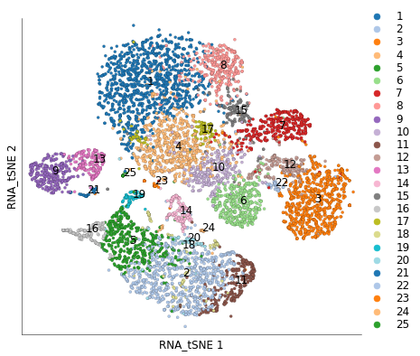


    time: 892 ms


Here, we do the same for Leiden clustering


```python
ds.run_leiden_clustering(resolution=3)
ds.plot_layout(layout_key='RNA_UMAP', color_by='RNA_leiden_cluster')
```


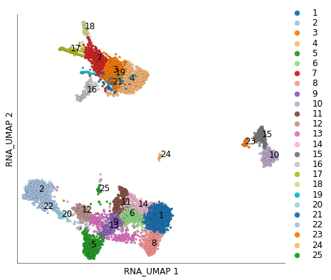


    time: 1.25 s


There has been a lot of discussion over the choice of non-linear dimension reduction for single-cell data. tSNE was initially considered an excellent solution but has gradually lost out to UMAP because the magnitude of relation between the clusters cannot easily be discerned in a tSNE plot. Scarf contains an implementation of tSNE that runs directly on the graph structure of cells. So essentially the same data that was used to create the UMAP and clustering is used. Additionally, to minimize the differences between the UMAP and tSNE, we use the same initial coordinates of tSNE as were used for UMAP, i.e. the first two (in case of 2D) PC axis of PCA of kmeans cluster centers. We have found that tSNE is actually a complementary technique to UMAP. While UMAP focuses on highlighting the cluster relationship, tSNE highlights the heterogeneity of the dataset. As we show in the 1M cell vignette, using tSNE can be better at visually accessing the extent of heterogeneity than UMAP. The biggest reason, however to run Scarf's implementation of graph tSNE could be the runtime which can be an order of magnitude faster than UMAP on large datasets.


```python
ds.run_tsne('../scarf/bin/sgtsne', alpha=20, box_h=1)
```

    Saving KNN matrix in MTX format: 100%|██████████| 7648/7648 [00:02<00:00, 3762.19it/s]


    b'Number of vertices: 7648'
    b'Embedding dimensions: 2'
    b'Rescaling parameter \xce\xbb: 1'
    b'Early exag. multiplier \xce\xb1: 20'
    b'Maximum iterations: 500'
    b'Early exag. iterations: 200'
    b'Box side length h: 1'
    b'Drop edges originating from leaf nodes? 0'
    b'Number of processes: 1'
    b'0 out of 7648 nodes already stochastic'
    b'Skipping \xce\xbb rescaling...'
    b'Nested dissection permutation...Permuting matrixDONE'
    b'm = 7648| n = 7648| nnnz = 273004'
    b'Working with double precision'
    b'Iteration 1: error is 218.674'
    b'Iteration 50: error is 173.562 (50 iterations in 0.255674 seconds)'
    b'Iteration 100: error is 165.539 (50 iterations in 0.179579 seconds)'
    b'Iteration 150: error is 163.621 (50 iterations in 0.173394 seconds)'
    b'Iteration 200: error is 5.14704 (50 iterations in 0.174446 seconds)'
    b'Iteration 250: error is 4.23858 (50 iterations in 0.17677 seconds)'
    b'Iteration 300: error is 3.59097 (50 iterations in 0.207879 seconds)'
    b'Iteration 350: error is 3.32849 (50 iterations in 0.248928 seconds)'
    b'Iteration 400: error is 3.17208 (50 iterations in 0.3439 seconds)'
    b'Iteration 450: error is 3.06505 (50 iterations in 0.349842 seconds)'
    b'Iteration 499: error is 2.9897 (50 iterations in 0.337986 seconds)'
    b'--- Time spent in each module ---'
    b''
    b'Attractive forces: 0.577215 sec [25.5983%] |  Repulsive forces: 1.67768 sec [74.4017%]'
    b'Saving embedding to: /media/parashar/d2-1-storage/storage/seq_data/scarf_manuscript/data/3e32c928-8fc6-40ef-a746-ccfa036f375f_output.txt'
    time: 4.85 s


```python
ds.plot_layout(layout_key='RNA_tSNE', color_by='RNA_cluster')
```


    time: 868 ms


We saw a 7x speedup compared to UMAP using tSNE with the given parameters. It is harder to compare the distances between the clusters here but easier to visually gauge the size of clusters and intra-cluster heterogeneity.

Discerning similarity between clusters can be difficult from visual inspection alone, especially for tSNE plots. `plot_cluster_tree` function plots the relationship between clusters as a binary tree. This tree is simply a condensation of the dendrogram obtained using Paris clustering.


```python
ds.plot_cluster_tree(cluster_key='RNA_cluster')
```

    Constructing graph from dendrogram: 100%|██████████| 7647/7647 [00:00<00:00, 108165.36it/s]


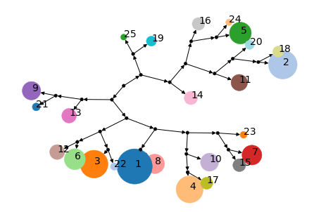


    time: 1.79 s


The tree is free form (i.e the position of clusters doesn't convey any meaning) but allows inspection of cluster similarity based on branching pattern. The sizes of clusters indicate the number of cells present in each cluster. The tree starts from the root node (black dot with no incoming edges). As an example, one can observe by looking at the branching pattern that cluster 1 is closer to cluster 8 than it is to cluster 4 since 1 and 8 share parent node whereas 4 is part of another branch. Cluster 4 is in turn closest to cluster 17. 

### 6) Marker gene identification

Now we can identify the genes that are differentially expressed between the clusters using `run_marker_search` method. The method to identify the differentially expressed genes in Scarf is optimized to obtain quick results. We have not compared the sensitivity of our method compared to other differential expression detecting methods and expect specialized methods to be more sensitive and accurate to varying degrees. Our method is designed to quickly obtain key marker genes for populations from a large dataset. For each gene individually following steps are carried out:
- Expression values are converted to ranks (dense format) across cells.
- A mean of ranks is calculated for each group of cells
- The mean value for each group is divided by the sum of mean values to obtain the 'specificity score'
- The gene is saved as a marker gene if it's specificity score is higher than a given threshold.

This method does not perform any statistical test of significance and uses 'specificity score' as a measure of importance of each gene for a cluster.


```python
ds.run_marker_search(group_key='RNA_cluster', threshold=0.2)
```

    Finding markers: 100%|██████████| 34/34 [00:12<00:00,  2.62it/s]
    
    time: 13.1 s


​    


Using `plot_marker_heatmap` we can also plot a heatmap with top marker genes from each cluster. The method will calculate the mean expression value for each gene from each cluster.


```python
ds.plot_marker_heatmap(group_key='RNA_cluster', topn=3)
```

    INFO: Calculating group mean values:   0%|          | 0/2 [00:00<?, ?it/s]
    
    [########################################] | 100% Completed |  0.9s


    INFO: Calculating group mean values:  50%|█████     | 1/2 [00:01<00:01,  1.69s/it]
    
    [########################################] | 100% Completed |  0.8s


    INFO: Calculating group mean values: 100%|██████████| 2/2 [00:03<00:00,  1.75s/it]


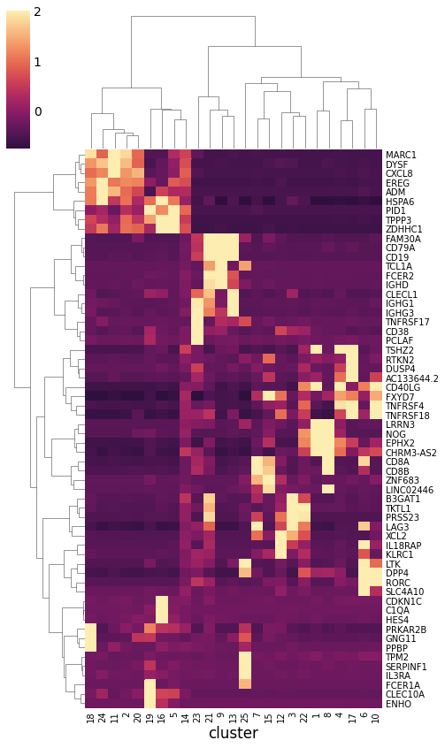


    time: 5.21 s


We can directly visualize the expression values for a gene of interest. It is usually a good idea to visually confirm the the gene expression pattern across the cells atleast this way.


```python
ds.plot_layout(layout_key='RNA_UMAP', color_by='PPBP')
```


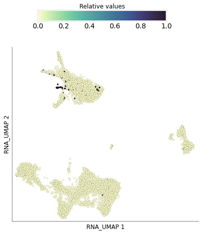


    time: 913 ms


### 7) Down sampling

UMAP, clustering and marker identification together allow a good understanding of cellular diversity. However, one can still choose from a plethora of other analysis on the data. For example, identification of cell differentiation trajectories. One of the major challenges to run these analysis could be the size of the data. Scarf performs a topology conserving downsampling of the data based on the cell neighbourhood graph. This downsampling aims to maximize the heterogeneity while sampling the cells from the the data. Before the actual subsampling step, two key steps must be performed.

The first step is the micro-clustering of the cells. Micro-clustering is performed using the dendrogram generated by the Paris algorithm. Rather than using a fixed distance value to cut the dendrogram to obtain cluster, a balanced cut is performed such the size of obtained clusters are bounded within the given limits. Below we perform balanced micro clustering and visualize the results


```python
ds.run_clustering(balanced_cut=True, min_size=20, max_size=100, label='b_cluster')
ds.plot_layout(layout_key='RNA_UMAP', color_by='RNA_b_cluster', legend_onside=False, legend_ondata=False)
```

    INFO: Using existing dendrogram


    Constructing graph from dendrogram: 100%|██████████| 7647/7647 [00:00<00:00, 79992.82it/s]
    Identifying nodes to split: 100%|██████████| 7648/7648 [00:00<00:00, 71820.31it/s]
    
    INFO: 125 clusters found


​    


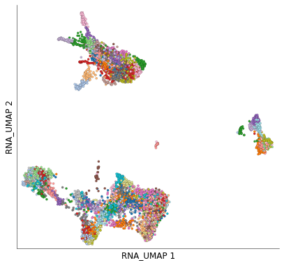


    time: 409 ms


So we obtained 125 micro clusters. It is good idea to make sure that small populations are divided into smaller clusters to facilitate comprehensive subsampling of even smaller clusters. The next is to calculate the neighbourhood density of nodes. A degree of a node (i.e. a cell in the graph) is the number of nodes it is connected to, the two step degree (aka 1 neighbourhood degree)of a cell is the sum of degrees of cells that a cell is connected to. We calculate the two neighbourhood degree of cells to obtain an estimate of how densely connected the cells are in each region of the graph. The more densely connected the cells are, the less the heterogeneity across them. These values are saved in the cell metadata table, here as 'RNA_node_density'. We can visualize these values using `plot_layout` method.


```python
ds.calc_node_density(neighbourhood_degree=2)
ds.plot_layout(layout_key='RNA_UMAP', color_by='RNA_node_density', clip_fraction=0.1, colormap='coolwarm')
```

    INFO: Calculating node out degree: 100%|██████████| 7648/7648 [00:01<00:00, 5813.65it/s]
    INFO: Calculating 1 neighbourhood: 100%|██████████| 7648/7648 [00:01<00:00, 6080.06it/s]
    INFO: Calculating 2 neighbourhood: 100%|██████████| 7648/7648 [00:01<00:00, 5741.04it/s]


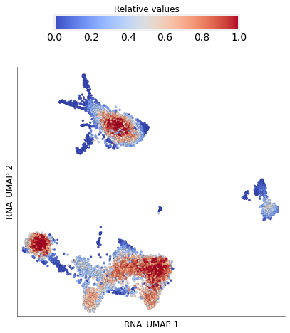


    time: 4.67 s


Now we are ready to perform down-sampling of cells. The extent of down sampling is primarily governed by the number of micro clusters, i.e. atleast 1 cell from each micro-cluster (*seed cells*) will be present in the down sampled data. However, this might not be sufficient to ensure that these will conserve the topology, i.e. are connected to each other. Hence, the `run_subsampling` method will run a prize-collecting Steiner graph search to ensure that *seed cells* are connected (to the extent that the full graph is connected). In order to do this we need to set a reward on each seed and non-seed cells. This is done using the parameter `rewards` which is provided a tuple with values for seed and non-seed cells. Low reward on seed cells might lead to them being excluded from the subsample (something that we should try to avoid). High reward on non-seed cells will lead to inflation of number of cells in the sample. We also set a value for parameter `seed_frac` which is the fraction of cells that should be randomly sampled from each micro-cluster. This value is dynamically increased to a maximum of double the `seed_frac` value based on the relative mean value of node density for that cluster. Hence, in effect we increase the sampling rate for micro clusters that have lower overall connectivity.


```python
ds.run_subsampling(seed_frac=0.05, rewards=(2, 0), min_nodes=1, min_edge_weight=0.1, 
                   cluster_key='RNA_b_cluster', density_key='RNA_node_density')
```

    INFO: 526 seed cells selected
    INFO: 1261 cells sub-sampled. 526 of which are present in seed list.
    INFO: Downsampling percentage: 16.49%
    INFO: Seed ratio: 2.397
    INFO: Sketched cells saved with keyname 'RNA_sketched'
    time: 283 ms


As a result of subsampling the sub sampled cells are marked True under the cell metadata column `RNA_sketched`. We can visualize these cells using `plot_layout`


```python
ds.plot_layout(layout_key='RNA_UMAP', color_by='RNA_cluster', subselection_key='RNA_sketched')
```


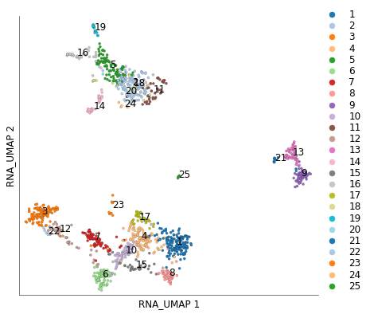


    time: 782 ms

As can be seen from the plot above the structure of the UMAP is preserved with 16.49% of the cells.


### 8) Working with non-default assays: surface protein expression (ADT) data

Hereon, we show how to work with non-default assay. Here we have surface protein data present in ADT assay. Let's check out the feature table for this assay.


```python
ds.ADT.feats.table
```


<div>

<table border="1" class="dataframe">
  <thead>
    <tr style="text-align: right;">
      <th></th>
      <th>I</th>
      <th>ids</th>
      <th>names</th>
      <th>nCells</th>
      <th>dropOuts</th>
    </tr>
  </thead>
  <tbody>
    <tr>
      <th>0</th>
      <td>True</td>
      <td>CD3</td>
      <td>CD3_TotalSeqB</td>
      <td>7864</td>
      <td>1</td>
    </tr>
    <tr>
      <th>1</th>
      <td>True</td>
      <td>CD4</td>
      <td>CD4_TotalSeqB</td>
      <td>7864</td>
      <td>1</td>
    </tr>
    <tr>
      <th>2</th>
      <td>True</td>
      <td>CD8a</td>
      <td>CD8a_TotalSeqB</td>
      <td>7863</td>
      <td>2</td>
    </tr>
    <tr>
      <th>3</th>
      <td>True</td>
      <td>CD14</td>
      <td>CD14_TotalSeqB</td>
      <td>7864</td>
      <td>1</td>
    </tr>
    <tr>
      <th>4</th>
      <td>True</td>
      <td>CD15</td>
      <td>CD15_TotalSeqB</td>
      <td>7864</td>
      <td>1</td>
    </tr>
    <tr>
      <th>5</th>
      <td>True</td>
      <td>CD16</td>
      <td>CD16_TotalSeqB</td>
      <td>7864</td>
      <td>1</td>
    </tr>
    <tr>
      <th>6</th>
      <td>True</td>
      <td>CD56</td>
      <td>CD56_TotalSeqB</td>
      <td>7864</td>
      <td>1</td>
    </tr>
    <tr>
      <th>7</th>
      <td>True</td>
      <td>CD19</td>
      <td>CD19_TotalSeqB</td>
      <td>7702</td>
      <td>163</td>
    </tr>
    <tr>
      <th>8</th>
      <td>True</td>
      <td>CD25</td>
      <td>CD25_TotalSeqB</td>
      <td>7861</td>
      <td>4</td>
    </tr>
    <tr>
      <th>9</th>
      <td>True</td>
      <td>CD45RA</td>
      <td>CD45RA_TotalSeqB</td>
      <td>7864</td>
      <td>1</td>
    </tr>
    <tr>
      <th>10</th>
      <td>True</td>
      <td>CD45RO</td>
      <td>CD45RO_TotalSeqB</td>
      <td>7864</td>
      <td>1</td>
    </tr>
    <tr>
      <th>11</th>
      <td>True</td>
      <td>PD-1</td>
      <td>PD-1_TotalSeqB</td>
      <td>7863</td>
      <td>2</td>
    </tr>
    <tr>
      <th>12</th>
      <td>True</td>
      <td>TIGIT</td>
      <td>TIGIT_TotalSeqB</td>
      <td>7849</td>
      <td>16</td>
    </tr>
    <tr>
      <th>13</th>
      <td>True</td>
      <td>CD127</td>
      <td>CD127_TotalSeqB</td>
      <td>7862</td>
      <td>3</td>
    </tr>
    <tr>
      <th>14</th>
      <td>True</td>
      <td>IgG2a</td>
      <td>IgG2a_control_TotalSeqB</td>
      <td>7839</td>
      <td>26</td>
    </tr>
    <tr>
      <th>15</th>
      <td>True</td>
      <td>IgG1</td>
      <td>IgG1_control_TotalSeqB</td>
      <td>7856</td>
      <td>9</td>
    </tr>
    <tr>
      <th>16</th>
      <td>True</td>
      <td>IgG2b</td>
      <td>IgG2b_control_TotalSeqB</td>
      <td>7639</td>
      <td>226</td>
    </tr>
  </tbody>
</table>
</div>


    time: 8.52 ms


We can manually filter out the control antibodies by updating `I` to be False for those features


```python
ds.ADT.feats.update((~ds.ADT.feats.table.names.str.contains('control')).values)
ds.ADT.feats.table
```


<div>

<table border="1" class="dataframe">
  <thead>
    <tr style="text-align: right;">
      <th></th>
      <th>I</th>
      <th>ids</th>
      <th>names</th>
      <th>nCells</th>
      <th>dropOuts</th>
    </tr>
  </thead>
  <tbody>
    <tr>
      <th>0</th>
      <td>True</td>
      <td>CD3</td>
      <td>CD3_TotalSeqB</td>
      <td>7864</td>
      <td>1</td>
    </tr>
    <tr>
      <th>1</th>
      <td>True</td>
      <td>CD4</td>
      <td>CD4_TotalSeqB</td>
      <td>7864</td>
      <td>1</td>
    </tr>
    <tr>
      <th>2</th>
      <td>True</td>
      <td>CD8a</td>
      <td>CD8a_TotalSeqB</td>
      <td>7863</td>
      <td>2</td>
    </tr>
    <tr>
      <th>3</th>
      <td>True</td>
      <td>CD14</td>
      <td>CD14_TotalSeqB</td>
      <td>7864</td>
      <td>1</td>
    </tr>
    <tr>
      <th>4</th>
      <td>True</td>
      <td>CD15</td>
      <td>CD15_TotalSeqB</td>
      <td>7864</td>
      <td>1</td>
    </tr>
    <tr>
      <th>5</th>
      <td>True</td>
      <td>CD16</td>
      <td>CD16_TotalSeqB</td>
      <td>7864</td>
      <td>1</td>
    </tr>
    <tr>
      <th>6</th>
      <td>True</td>
      <td>CD56</td>
      <td>CD56_TotalSeqB</td>
      <td>7864</td>
      <td>1</td>
    </tr>
    <tr>
      <th>7</th>
      <td>True</td>
      <td>CD19</td>
      <td>CD19_TotalSeqB</td>
      <td>7702</td>
      <td>163</td>
    </tr>
    <tr>
      <th>8</th>
      <td>True</td>
      <td>CD25</td>
      <td>CD25_TotalSeqB</td>
      <td>7861</td>
      <td>4</td>
    </tr>
    <tr>
      <th>9</th>
      <td>True</td>
      <td>CD45RA</td>
      <td>CD45RA_TotalSeqB</td>
      <td>7864</td>
      <td>1</td>
    </tr>
    <tr>
      <th>10</th>
      <td>True</td>
      <td>CD45RO</td>
      <td>CD45RO_TotalSeqB</td>
      <td>7864</td>
      <td>1</td>
    </tr>
    <tr>
      <th>11</th>
      <td>True</td>
      <td>PD-1</td>
      <td>PD-1_TotalSeqB</td>
      <td>7863</td>
      <td>2</td>
    </tr>
    <tr>
      <th>12</th>
      <td>True</td>
      <td>TIGIT</td>
      <td>TIGIT_TotalSeqB</td>
      <td>7849</td>
      <td>16</td>
    </tr>
    <tr>
      <th>13</th>
      <td>True</td>
      <td>CD127</td>
      <td>CD127_TotalSeqB</td>
      <td>7862</td>
      <td>3</td>
    </tr>
    <tr>
      <th>14</th>
      <td>False</td>
      <td>IgG2a</td>
      <td>IgG2a_control_TotalSeqB</td>
      <td>7839</td>
      <td>26</td>
    </tr>
    <tr>
      <th>15</th>
      <td>False</td>
      <td>IgG1</td>
      <td>IgG1_control_TotalSeqB</td>
      <td>7856</td>
      <td>9</td>
    </tr>
    <tr>
      <th>16</th>
      <td>False</td>
      <td>IgG2b</td>
      <td>IgG2b_control_TotalSeqB</td>
      <td>7639</td>
      <td>226</td>
    </tr>
  </tbody>
</table>
</div>


    time: 11 ms


Assays named ADT are automatically created as objects of ADTassay class that uses CLR normalization as the default normalization method.


```python
print (ds.ADT)
print (ds.ADT.normMethod.__name__)
```

    ADTassay ADT with 14(17) features
    norm_clr
    time: 59.7 ms


Now we create a new graph of cells using just the `ADT` data.


```python
ds.make_graph(from_assay='ADT', feat_key='I', k=11, dims=11, n_centroids=100, log_transform=False)
```

    INFO: No value provided for parameter `renormalize_subset`. Will use default value: True
    INFO: No value provided for parameter `pca_cell_key`. Will use same value as cell_key: I
    INFO: Using PCA for dimension reduction
    INFO: No value provided for parameter `ann_metric`. Will use default value: l2
    INFO: No value provided for parameter `ann_efc`. Will use default value: min(max(48, int(dims * 1.5)), 64)
    INFO: No value provided for parameter `ann_efc`. Will use default value: min(max(48, int(dims * 1.5)), 64)
    INFO: No value provided for parameter `ann_m`. Will use default value: 48
    INFO: No value provided for parameter `rand_state`. Will use default value: 4466
    INFO: No value provided for parameter `local_connectivity`. Will use default value: 1.0
    INFO: No value provided for parameter `bandwidth`. Will use default value: 1.5


    Writing data to normed__I__I/data: 100%|██████████| 8/8 [00:01<00:00,  6.88it/s]
    
    INFO: Calculating mean of norm. data
    [##                                      ] | 5% Completed |  0.0s


​    


    [########################################] | 100% Completed |  0.1s
    INFO: Calculating std. dev. of norm. data
    [########################################] | 100% Completed |  0.1s


    Fitting PCA: 100%|██████████| 8/8 [00:00<00:00, 29.78it/s]
    Fitting ANN: 100%|██████████| 8/8 [00:00<00:00, 20.88it/s]
    Fitting kmeans: 100%|██████████| 8/8 [00:00<00:00, 28.38it/s]
    Estimating seed partitions: 100%|██████████| 8/8 [00:00<00:00, 33.53it/s]
    Saving KNN graph: 100%|██████████| 8/8 [00:00<00:00, 23.45it/s]
    
    INFO: ANN recall: 99.96%


​    
​    Smoothening KNN distances: 100%|██████████| 1/1 [00:00<00:00, 44.80it/s]
​    
​    time: 3.12 s


​    


Run UMAP on `ADT` graph


```python
ds.run_umap(from_assay='ADT', fit_n_epochs=500)
```

    	completed  0  /  500 epochs
    	completed  50  /  500 epochs
    	completed  100  /  500 epochs
    	completed  150  /  500 epochs
    	completed  200  /  500 epochs
    	completed  250  /  500 epochs
    	completed  300  /  500 epochs
    	completed  350  /  500 epochs
    	completed  400  /  500 epochs
    	completed  450  /  500 epochs
    	completed  0  /  100 epochs
    	completed  10  /  100 epochs
    	completed  20  /  100 epochs
    	completed  30  /  100 epochs
    	completed  40  /  100 epochs
    	completed  50  /  100 epochs
    	completed  60  /  100 epochs
    	completed  70  /  100 epochs
    	completed  80  /  100 epochs
    	completed  90  /  100 epochs
    time: 24.3 s


One can check concordance between RNA and ADT assays by visualizing the RNA cluster information on ADT data


```python
ds.plot_layout(layout_key='ADT_UMAP', color_by='RNA_cluster')
```


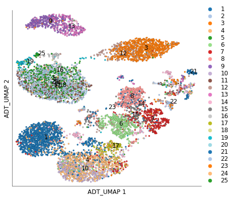


    time: 886 ms


We can also run the clustering directly on `ADT` graph and visualize it on UMAP


```python
ds.run_clustering(from_assay='ADT', n_clusters=20)
ds.plot_layout(layout_key='ADT_UMAP', color_by='ADT_cluster')
```

    /home/parashar/miniconda3/lib/python3.7/site-packages/sknetwork/hierarchy/postprocess.py:38: VisibleDeprecationWarning: Creating an ndarray from ragged nested sequences (which is a list-or-tuple of lists-or-tuples-or ndarrays with different lengths or shapes) is deprecated. If you meant to do this, you must specify 'dtype=object' when creating the ndarray
      clusters = np.array(list(cluster.values()))


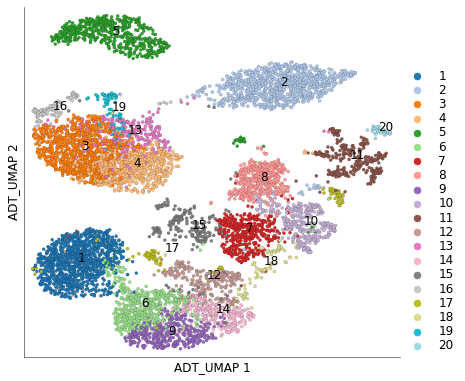


    time: 1.16 s


Or the other way, visualize ADT clusters on RNA UMAP


```python
ds.plot_layout(layout_key='RNA_UMAP', color_by='ADT_cluster')
```


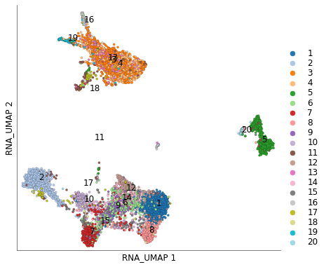


    time: 652 ms


Individual ADT expression can be visualized in both UMAPs easily.


```python
ds.plot_layout(from_assay='ADT', layout_key='ADT_UMAP', color_by='CD3_TotalSeqB')
ds.plot_layout(from_assay='ADT', layout_key='RNA_UMAP', color_by='CD3_TotalSeqB')
```


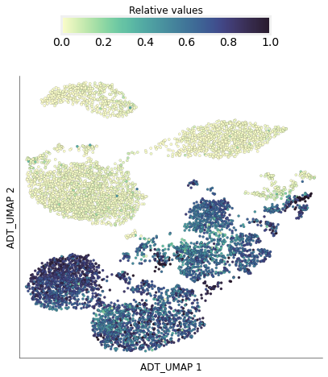


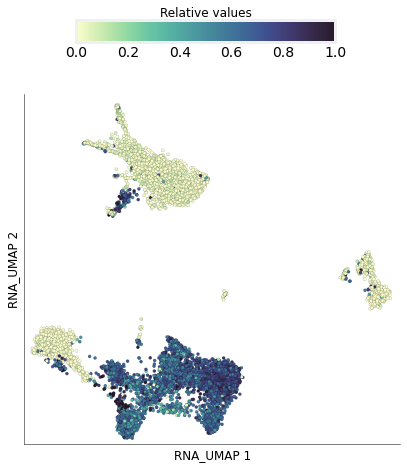


    time: 2.18 s


##### End of vignette
